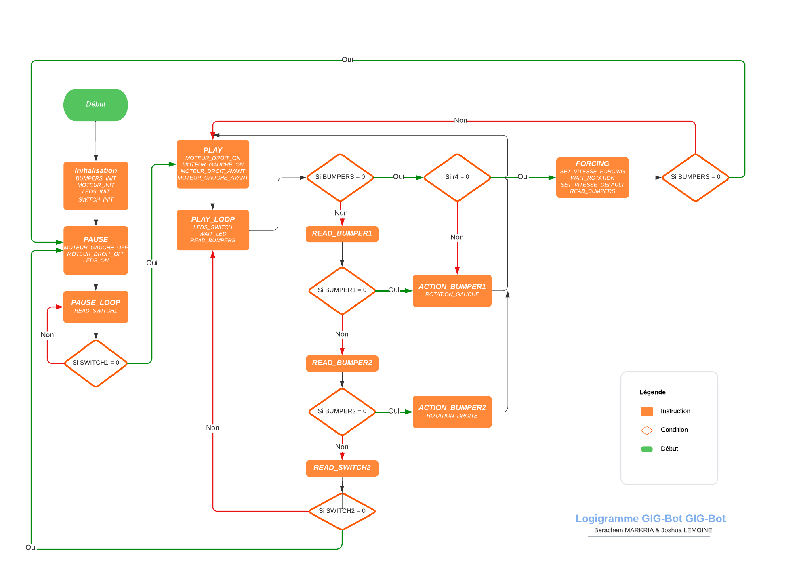
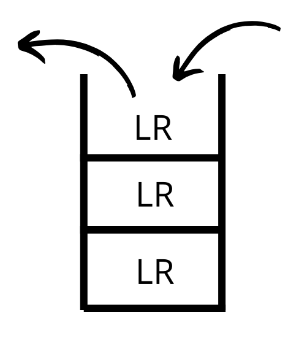
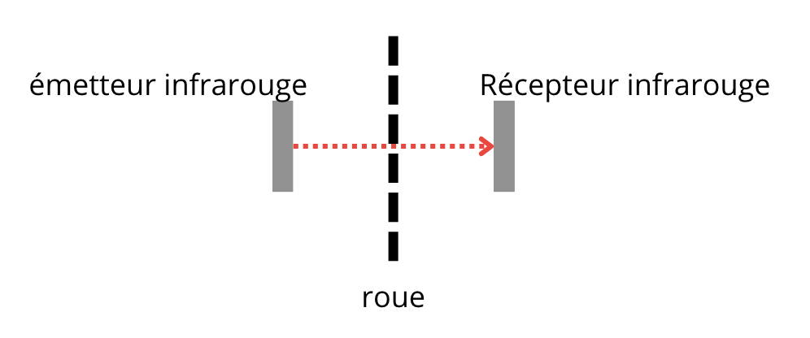

# GIG-Bot 🤖

<center>
    
</center>

Bienvenue dans le projet GIG-Bot, un robot éclaireur innovant pour les interventions délicates du GIGN. 

Le code a été écrit en assembleur __Cortex M3 (ARM M3)__ et a été déployé sur des robots EVALBOT (Stellaris, Texas instrument)

Lien vers le rapport du projet : [Rapport-Projet-G2I02_3I-IN1.pdf](https://github.com/Berachem/eval-bot/files/13728150/Rapport-Projet-G2I02_3I-IN1.pdf)

## Description du Projet 📄

Le GIG-Bot étend les capacités de l'EVALBOT en utilisant efficacement ses périphériques clés tels que LEDs, bumpers, switches, et moteurs. Le robot vise à remplacer les chiens d'intervention du GIGN, offrant une solution autonome et sécurisée.

## Structure du Code 🧩

Le code est organisé en cinq fichiers distincts, chacun dédié à un composant spécifique du robot :
- Leds.s 🌈
- Bumper.s 🚧
- Switch.s 🔄
- Moteur.s 🚀
- Main.s 🧠

Chaque fichier contient des routines et des configurations spécifiques au composant, permettant une maintenance et une collaboration efficaces.

## Représentations Visuelles 📊

### Logigramme
<center>
    
</center>

### Pseudo-code
```
Début

Initialiser les bumpers, moteurs, LEDs, et switchs

Définir le nombre de collisions frontales avant forcing à 5

Boucle PAUSE
    Désactiver les moteurs
    Allumer les LEDs
    Tant que SWITCH1 n'est pas activé
        Attendre
    Fin de la boucle

Boucle PLAY
    Activer les moteurs
    Faire avancer les moteurs
    Tant que SWITCH2 n'est pas activé
        Changer l'état des LEDs
        Attendre un court moment
        Si une collision frontale est détectée
            Si le nombre de collisions frontales atteint le seuil
                Passage en force
            Sinon
                Rotation à droite
            Fin de la condition
        Sinon si BUMPER1 est activé
            Rotation à gauche
        Sinon si BUMPER2 est activé
            Rotation à droite
        Fin de la condition
    Fin de la boucle

Fin de la boucle PLAY

Fin
```

## Réalisations 🎉

Si on allume le GIG-Bot:
1. Celui-ci avance en faisant clignoter ses deux lumières le rendant plus visible à travers des
fumigènes notamment.

        - moteurs 1 & 2 AVANT 
        - clignotement des LED 1 & 2
   
3. On peut faire PAUSE de l'exécution en appuyant sur le switch 1, ce qui gardera allumé de façon
constante les deux lumières en attendant que l'agent appuie sur le switch 2

        - lecture des Switch 1 & 2
        - allumage des LED 1 & 2
   
5. Lorsqu'il bute un obstacle (bumpers), il va arrêter de clignoter ses LEDs, effectuer une rotation
(si l'obstacle est à gauche, vers la droite. si l'obstacle est à droite, vers la gauche. si l'obstacle est en
face pile, vers l'arrière) allumant la LEDs du côté de où il va tourner et changer de direction

        - lecture des Bumpers 1 & 2
        - clignotement de LED 1 OU 2
        - moteur 1 OU 2 ARRIÈRE
   
7. S’il s’agît de la 4ème collision frontale (deux bumpers), le GIG-Bot active un mode “Forcing” en
accélérant et forçant sur l’obstacle. S’il refait une collision frontale après son forcing (l’obstacle n’a
pas bougé) alors il se met en PAUSE sinon il reprend son processus de base (étape 1).

        - augmentation/diminution vitesse moteur
   
9. On revient à l'étape 1.

## Difficultés et Solutions 🤔

### Séparation du code en plusieurs fichiers
> Notre principal défi résidait dans l'ajustement nécessaire à l'extrême linéarité de l'assembleur, une
approche bien éloignée de la pensée plus fluide et structurée que certains d'entre nous avaient déjà
développée en travaillant avec des langages de haut niveau. L'assembleur, en tant que langage bas
niveau, impose une séquence rigide d'instructions, ce qui contraste fortement avec la flexibilité
conceptuelle offerte par les langages plus abstraits.
La solution s’est à été trouvée au moment où nous avons appris comment créer une architecture
modulaire en assembleur. En utilisant des concepts comme les routines par exemple. Nous avons
donc divisé notre code en plusieurs sections logiques, chacune étant responsable d'une
fonctionnalité spécifique du robot. Chaque section a été écrite dans un fichier séparé, garantissant
que chaque composant pouvait être compilé et testé indépendamment des autres, facilitant ainsi la
gestion et la maintenance du code.

### Pile de LR
> Enfin, un autre défi était de gérer les retours successifs au code précédent avec les instructions BX
LR. Parfois, l’adresse précédente était écrasée, nous avons donc choisi d’utiliser les instructions
PUSH & POP qui utilisent la pile d'instructions comme stockage .
> 
<center>
    
</center>

## Évolutions Envisagées 🚀

<center>
    
</center>

### Utilisation des émetteurs et capteurs infrarouge
> nous avons envisagé de gérer la distance et le temps écoulés grâce
aux émetteurs et récepteurs infrarouges situés aux extrémités des roues du GIG-Bot en
analysant la succession des “petits trous sur la roue”. Cependant, après avoir réalisé des tests, nous
avons constaté que la difficulté était trop élevée.
Selon la datasheet de Texas Instruments (p1206), le module QEI (Quadrature Encoder Interface) est
capable d’interpréter le code gray à deux bits produit par une roue codeuse en quadrature pour
intégrer la position dans le temps et déterminer la direction de rotation. De plus, il peut capturer
une estimation en cours de la vitesse de la roue.
Les signaux de phase, PhA et PhB, peuvent être interprétés comme un signal d’horloge et de
direction. Le module “QEI” dispose également d’un filtre numérique de bruit sur ses signaux
d’entrée qui peut être activé pour prévenir une opération erronée. Ce filtre nécessite que les
entrées soient stables pendant un certain nombre de cycles d’horloge consécutifs avant de mettre à
jour le détecteur de bord.

Cependant, malgré ces fonctionnalités avancées, l’implémentation de cette technologie dans notre
projet s’est avérée être un défi majeur quoique très instructif.

## Conclusion 🎓

Le GIG-Bot représente une avancée significative pour l'EVALBOT, offrant une base solide pour des développements futurs. 

__Nous sommes heureux du rendu final du projet. Il nous a réellement aidé à mettre un
pied concret dans le monde de l’assembleur et ce de façon ludique ! 🙂__

## Auteurs 👨‍💻👨‍💻

- <a href="https://berachem.dev">Berachem 'Berachem'  MARKRIA </a>
- Joshua 'Kilouhardi' LEMOINE 

Nous sommes fiers du rendu final du projet, une immersion ludique dans le monde de l'assembleur ! 🙂


